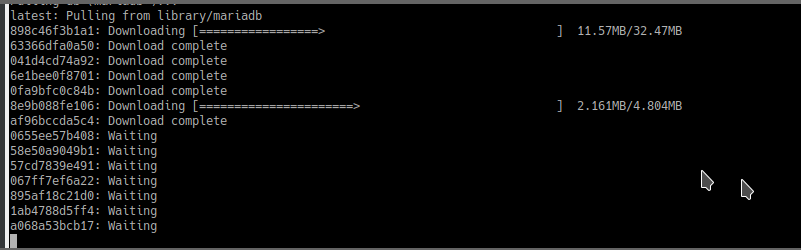
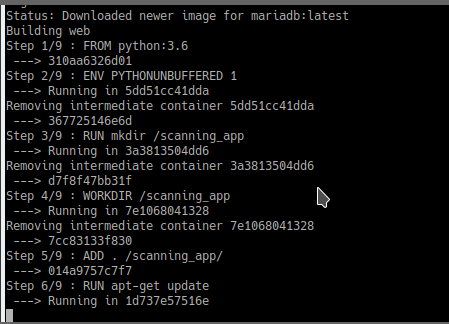
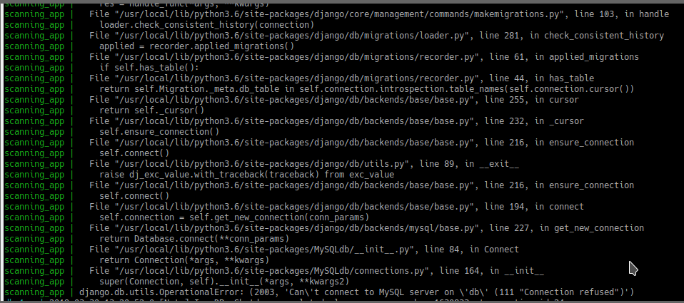
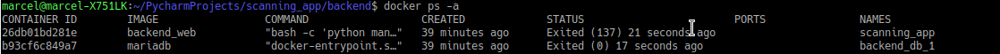
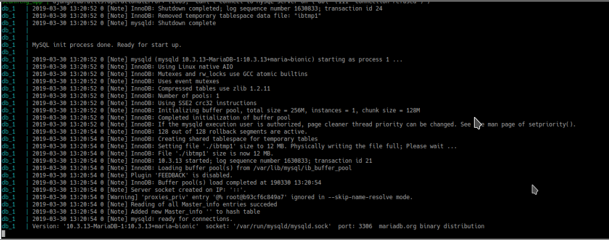
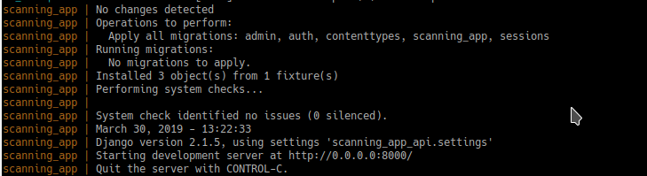
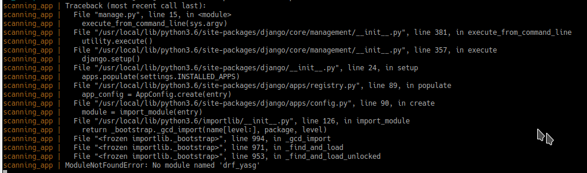
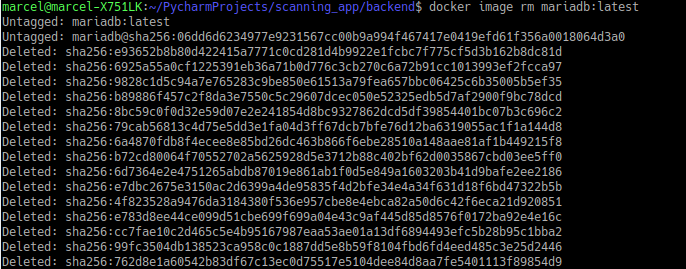

**Backend Start**

To start docker you should be in path `scanning_app/backend` \
Then write `docker-compose up`, you should see that images are downloading\
\
Then docker should run its commands\
\
After few minutes you should see 3/4 messages like that\
\
If message above shows more than 5/6 times then try to CTRL+C and again type `docker-compose up` \
If it does not help make sure that you have both containers by typing `docker ps -a`\
 You should see \
\
If there is `Can't connect to MySQL server on localhost` then we have some mistakes in implementation \
If everything goes well then you should see\
\
After few second you should see \
\
If it did not appear after few second then feel free to press CTRL+C and run `docker-compose up` again, after that it should start working

If you already run backend before and there was some changes in requirements.txt file you should get error like that 
>No Module named {name of module} 

\
It means that your images are not up to date \
Firstly make sure your containers are down by typing `docker-compose down`\
Then You have to delete images by typing `docker image rm backend_web` and then `docker image rm mariadb:latest`\
After seeing twice these messages\
\
You can easily type `docker-compose up` and it should start over downloading\

