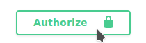

# **Backend Start** :zap:

To start docker you should be in path `scanning_app/backend` \
Then write `docker-compose up`, you should see that images are downloading\
\
Then docker should run its commands\
\
After few minutes you should see 3/4 messages like that\
\
If message above shows more than 5/6 times then try to CTRL+C and again type `docker-compose up` \
If it does not help make sure that you have both containers by typing `docker ps -a`\
 You should see \
\
If there is `Can't connect to MySQL server on localhost` then we have some mistakes in implementation \
If everything goes well then you should see\
\
After few second you should see \
\
If it did not appear after few second then feel free to press CTRL+C and run `docker-compose up` again, after that it should start working

If you already run backend before and there was some changes in requirements.txt file you should get error like that 
>No Module named {name of module} 

\
It means that your images are not up to date \
Firstly make sure your containers are down by typing `docker-compose down`\
Then You have to delete images by typing `docker image rm backend_web` and then `docker image rm mariadb:latest`\
After seeing twice these messages\
\
You can easily type `docker-compose up` and it should start over downloading  :sunglasses: :sunglasses:

# **Swagger** :fire:

Firstly to connect to swagger you have to run backend by doing steps above\
Then you can type in your browser [http://localhost:8000/swagger/]() 

In swagger BASIC URL is [localhost:8000/api-v1]()\
It means that you have to type the link above before every postfix in your browser\
For example [localhost:8000/api-v1/equipment/]()

### ***To authenticate in swagger***

**If you do not have account or you do not want to use basics accounts**

You can go to [http://localhost:8000/api-v1/signup]() with POST method (choose option to post on signup option) and create your own user\
Afterwards you have to go to [http://localhost:8000/api-v1/login]() to authorize yourself and copy `access code`\
Then you have to click button "Authorize"  

There you have to paste the access code with prefix `Bearer` as a value            

For example `Bearer eyJ0eXAiOiJKV1QiLCJhbGyYjhkNCjR9.eUqULpWnJW1xHtCA61EuTWEek9Y0_1cxFUyPzpRQbcY`\
Then you can easily work with Swagger   :smiley:

**If you have account or you want to use basics accounts**

You can directly go to the [http://localhost:8000/api-v1/login]() and follow steps from above

