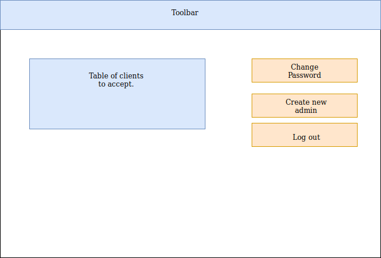

# Scenariusze użycia - administrator

## Logowanie się
Administrator loguje się do swojego panelu za pomocą nadanego loginu i hasła, zalogowanie się (jest warunkiem koniecznym do wykonania jakiegokolwiek działania). Istnieje możliwość zresetowania hasła.

## Lista dostępnego sprzętu
Po zalogowaniu się administrator zostaje przekierowany na stronę z listą całego sprzętu znajdującego się w magazynie. Zakładka sprzęt. Po kliknięciu wybranego wiersza widzimy szczegółowe informacje o danej rzeczy.
W liście widzimy informacje o:
1. nazwa sprzętu
2. typ
3. dotępność (tak/nie)
4. Możliwość edycji
5. Możliwość usunięcia

Mozliwość filtrowania listy po:
1. nazwie sprzętu (wyszukiwanie po nazwie)
2. Kategorii (Select istniejących kategorii)

## Dodawanie nowego sprzętu
Na stronie z listą całego sprzętu znajduję się przycisk "Dodaj" za pomocą, którego dodajemy do bazy nowy sprzęt. Po kliknięciu zostajemy przekierowani do panelu, w którym trzeba wypełnić informacje o danym sprzęcie. Podajemy:
1. Nazwę
2. Typ (Select możliwych)
3. Opis (opcjonalnie)
4. Zdjęcie (opcjonalnie)
5. Maksymalny czas wypożyczenia 

Po dodaniu rzeczy generowany jest dla niej QRCode, który następnie można pobrać i wydrukować.

## Lista rzeczy aktualnie wypożyczonych
Dostepna jest lista rzeczy wypożyczonych w danej chwili. Zakładka wypozyczenia.
W liście widzimy informacje o:
1. nazwa sprzętu
2. imię i nazwisko wypożyczającego
3. data wypożyczenia
4. przewidywana data zwrotu
5. gdzie sprzęt został wypożyczony

Filrowanie po:
1. Nazwie rzeczy
2. Data wypożyczenia (rosnąco/malejąco)
3. Data zwrotu (rosnąco/malejąco)

## Lista klientów upoważnionych do wypożyczeń
 Zakładka klienci.
W liście widzimy informacje o:
1. imię i nazwisko
2. e-mail
3. numer telefonu
4. informacja o firma czy osoba fizyczna
5. opcja wysłania wiadomości
6. Możliwość usunięcia klienta

Filrowanie po:
1. Imię i nazwisko klienta

## Lista historii wszystkich wypożyczeń
Lista z historią wszystkich wypożyczeń "archiwalnych". Zakładka historia.
W liście widzimy informacje o:
1. nazwa sprzętu
2. imię i nazwisko wypożyczającego
3. data wypożyczenia
4. data zwrotu
5. gdzie sprzęt został wypożyczony

Filrowanie po:
1. Imię i nazwisko klienta

## Panel - konto administartora
W tym miejscu dostępna jest lista klientów oczekujących na zaakceptowanie przez administratora (lista analogiczna do listy klientów). Administrator może zmienić w tym miejscu swoje hasło, stworzyć nowy profil administratora o niższych prawach (nadanie loginu i hasła, podanie adresu e-mail) tj. brak możliwości usuwania i klientów oraz wylogować się.

